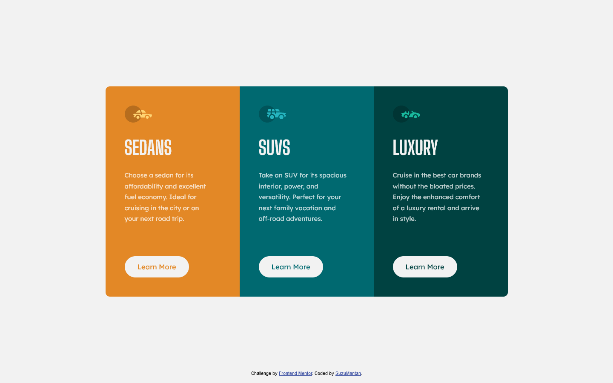

# Frontend Mentor - 3-column preview card component solution

This is a solution to the [3-column preview card component challenge on Frontend Mentor](https://www.frontendmentor.io/challenges/3column-preview-card-component-pH92eAR2-). Frontend Mentor challenges help you improve your coding skills by building realistic projects.

## Table of contents

- [Overview](#overview)
  - [The challenge](#the-challenge)
  - [Screenshot](#screenshot)
  - [Links](#links)
- [My process](#my-process)
  - [Built with](#built-with)
  - [What I learned](#what-i-learned)

## Overview

### The challenge

Users should be able to:

- View the optimal layout depending on their device's screen size
- See hover states for interactive elements

### Screenshot



### Links

- Solution URL: [Code](https://github.com/agusthas/FEM_3-column-preview-card-component)
- Live Site URL: [Live Site](https://agusthas.github.io/FEM_3-column-preview-card-component/)

## My process

### Built with

- Flexbox
- Mobile-first workflow
- SASS

### What I learned

I learned that i can set different radius on different points with a shorthand.

```css
border-radius: 10px 10px 0 0;

/* Instead of */
border-top-left-radius: 10px;
border-top-right-radius: 10px;
border-bottom-right-radius: 0;
border-bottom-left-radius: 0;
```
